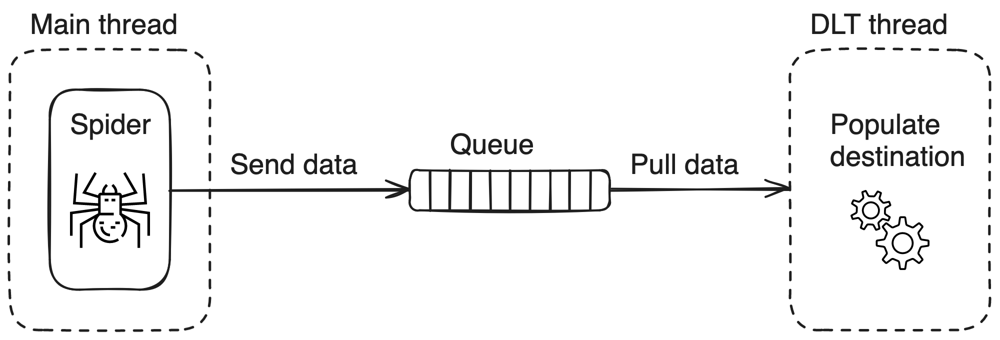

# Scraping

Scraping source allows you to scrape content from web and uses [Scrapy](https://doc.scrapy.org/en/latest/)
to enable this capability.

It is possible to access and manipulate a scraping resource via (please see `scraping_pipeline.py`)

1. `on_before_start` callback which will receive a `DltResource` as the only argument,
2. The advanced scraping pipeline builder `scraping.helpers.create_pipeline_runner`

## Initialize the pipeline

```bash
dlt init scraping duckdb
```

## 🎲 Configuration

It is possible to provide configuration via `.dlt/config.toml` below you can see an example

```toml
[sources.scraping]
# Batch size - how many scraped results to collect
# before dispatching to DLT pipeline
batch_size = 100
# Defaul queue size
queue_size = 3000
# How log to wait before exiting
queue_result_timeout = 3.0
start_urls = [
    "https://quotes.toscrape.com/page/1/"
]
start_urls_file="/path/to/urls.txt"
```

When both `start_urls` and `start_urls_file` they will be merged and deduplicated so Scrapy
gets a unique set of `start_urls`.

## 🏎️ Running the pipeline

Install requirements and run the pipeline

```sh
pip install -r requirements.txt
python scraping_pipeline.py
```

## 🧐 Introspection using streamlit

NOTE: you might need to set up `streamlit`, `pip install streamlit`

```sh
dlt pipeline <pipeline_name> show
```


## 🧠 How it works?

Under the hood we run DLT [pipeline](https://dlthub.com/docs/api_reference/pipeline) in a separate thread while scrapy is running in the main thread.

Communication between the two is done via the queue, where

* Spider is responsible to put the results in the queue,
* DLT resource collects and batches results from the queue.



<p align="center"><strong>Enjoy it!<strong></p>
<hr>
<p align="center">✨ 🚀 ✨</p>
